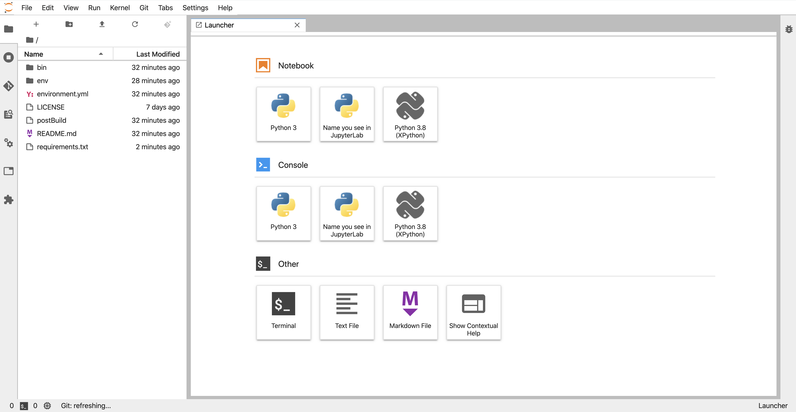

### Best practices for managing JupyterLab-based data science projects using Conda (+pip)

@snap[south span-100]
JupyterCon 2020, 12-16 October
@snapend

---


#### Dr. David R. Pugh
Staff Scientist, [KAUST Visualization Core Lab](https://corelabs.kaust.edu.sa/labs/detail/visualization-core-lab)
Certified Instructor, [The Carpentries](https://carpentries.org/)

---

@snap[north-west]
### Outline
@snapend

@ul[spaced]
* "System-wide" JupyterLab installation
* "Project-based" JupyterLab installation
* Provide some "best-practices"
* Discuss the relevant tradeoffs
@ulend

---

@snap[north-west]
### "System-wide" JupyterLab
@snapend

@snap[west]
Conda (+pip) manage a JupyterLab installation shared across all projects.

@ul[spaced]
* Common set of JupyterLab extensions simplifies user interface (UI) and user experience (UX).
* Allows for quicker start of new projects as no need to install (and build!) JupyterLab.
* Easy low-level configuration of JupyterLab via files inside the `~/.jupyter` directory in your user home directory.
@ulend
@snapend

---

@snap[north-west]
#### `environment.yml` for a "system-wide" install
@snapend

```yaml
name: jupyterlab-base-env

channels:
  - conda-forge
  - defaults
  
dependencies:
  - jupyterlab
  - jupyterlab-git # provides git support
  - nodejs # required for building (some) extensions
  - pip
  - pip:
    - -r file:requirements.txt # extensions available via pip go here
  - python
  - xeus-python
```

---

@snap[north-west]
#### `requirements.txt` for a "system-wide" install
@snapend

```bash
jupyter-lsp
python-language-server[all]
```

---

@snap[north-west]
#### Keep your `jupyterlab-base-env` *lean*
@snapend

@snap[west]
Environment should *only* contain JupyterLab and required extensions (+deps).

@ul[spaced]
* Automate environment build with Bash script.
* Each of your projects should have separate Conda (+pip) environment.
* Create custom Jupyter kernels for project Conda (+pip) environments.
@ulend
@snapend

---

@snap[north-west]
#### Automate environment build with Bash script
@snapend

```bash
#!/bin/bash --login
set -e

conda env create \
    --name jupyterlab-base-env \
    --file environment.yml \
    --force
conda activate jupyterlab-base-env
source postBuild # put jupyter labextension install commands here
```

---

@snap[north-west]
#### Creating Jupyter kernels for Conda environments
@snapend

@snap[west]
Allows you to launch Jupyter Notebooks and IPython consoles for different Conda (+pip) environments within a common JupyterLab installation.

@ul[spaced]
* Can automate process for all Conda (+pip) envs using [`jupyter-conda`](https://github.com/fcollonval/jupyter_conda) extension.
* Can manually create custom Jupyter kernel for particular Conda (+pip) envs.
@ulend

@snapend

---

@snap[north-west]
#### How to manually create custom Jupyter kernel
@snapend

```bash
conda activate $PROJECT_DIR/env # don't forget to activate env first!
python -m ipykernel install \ # requires ipykernel installed in the env
    --user \
    --name $PROJECT_NAME-kernel \ # for internal use only!
    --display-name "Name you will see in JupyerLab"
```

---

@snap[north-west]
#### Example
@snapend



---

@snap[north-west]
#### `%conda` and `%pip` magic commands
@snapend

@snap[west]
Built-in IPython magic commands for installing packages into the *active* kernel via Conda ([`%conda`](https://ipython.readthedocs.io/en/stable/interactive/magics.html#magic-conda)) or Pip ([`%pip`](https://ipython.readthedocs.io/en/stable/interactive/magics.html#magic-pip)).

@ul[spaced]
* Both commands can be used from within Jupyter Notebooks or IPython consoles. 
* Both `%conda` and `%pip` are mostly useful for prototyping new projects.
* For "production", prefer adding new packages to `environment.yml`/`requirements.txt` (and rebuilding environment).
@ulend
@snapend

---

@snap[north-west]
### "Project-based" JupyterLab
@snapend

@snap[west]
Conda (+pip) manage separate JupyterLab installations for each project.

@ul[spaced]
* More flexible UI/UX as JupyterLab version and extensions can customized for each project.
* Easier experimentation with bleeding edge features of JupyterLab.
* Automatically makes a data science project repo ["Binder-ready"](https://mybinder.org/). 
@ulend
@snapend

---

@snap[north-west]
#### `environment.yml` for a "project-based" install
@snapend

```yaml
name: null

channels:
  - conda-forge
  - defaults
  
dependencies:
  - jupyterlab
  - jupyterlab-git # extensions available via conda go here
  - nodejs
  - pandas
  - pip
  - pip:
    - -r file:requirements.txt # packages available via pip go here
  - python
  - scikit-learn
```
---

@snap[north-west]
#### Automate environment creation with Bash script
@snapend

```bash
#!/bin/bash --login
set -e

export ENV_PREFIX=$PROJECT_DIR/env # directory included in .gitignore
conda env create \
    --prefix $ENV_PREFIX 
    --file environment.yml \
    --force
conda activate $ENV_PREFIX
source postBuild # put jupyter labextension install commands here
```

---

@snap[north-west]
#### Examples of "project-based" JupyterLab installs
@snapend

* [JupyterLab + Scikit Learn + friends](https://github.com/davidrpugh/jupytercon-2020-talk/tree/scikit-learn-env)
* [JupyterLab + PyTorch + friends](https://github.com/davidrpugh/jupytercon-2020-talk/tree/pytorch-env)
* [JupyterLab + NVIDIA RAPIDS + BlazingSQL + Dask](https://github.com/davidrpugh/jupytercon-2020-talk/tree/nvidia-rapids-env)

---

@snap[north-west]
#### "System-wide" or "project-based"?
@snapend

@ul[spaced]
* Prefer "project-based" for its greater flexibility with minimal additional overhead. 
* Prefer "project-based" if only some of your projects use GPUs. 
* Prefer "system-wide" when all projects use a common set of extensions.
@ulend

---

@snap[north-west]
### Thanks!
@snapend


@snap[south-west text-08]
@fa[twitter](TheSandyCoder)
@snapend

@snap[south text-08]
@fa[github](davidrpugh)
@snapend

@snap[south-east text-08]
@fa[linkedin](davidrpugh)
@snapend
